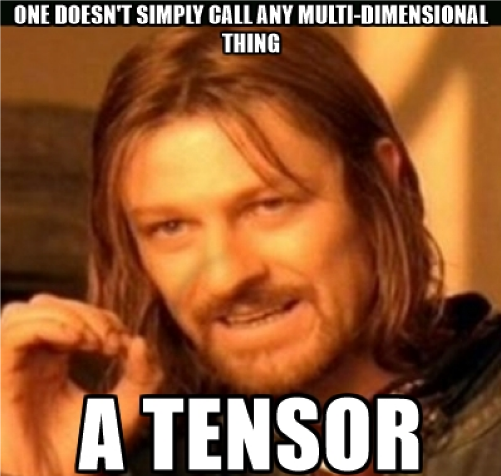

# TensorLib
It is a minimalist Tensor library.

It is an experimental Tensor library which is purely written in *C++*.

It is able to perform various operation which ranges from basic to intermediate level.